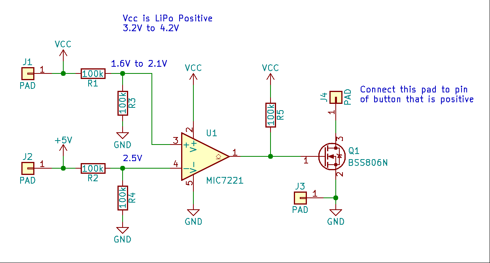

# 18650 Battery Shield Keep Alive Circuit

The following circuit was designed to keep the 5V rail of a 18650 Battery Shield active even with no load attached. A comparator will "press" the tactile switch when the 5V rail goes below the 3V3 rail.

The circuit is built on a small one sided PCB that is attached to the battery shield using hot glue. Electrical connections are made using multi-strand wire.

Below is a photo of an unmodified 18650 Battery Shield. They may use keywords such as ESP32 or Raspberry Pi battery shield.

